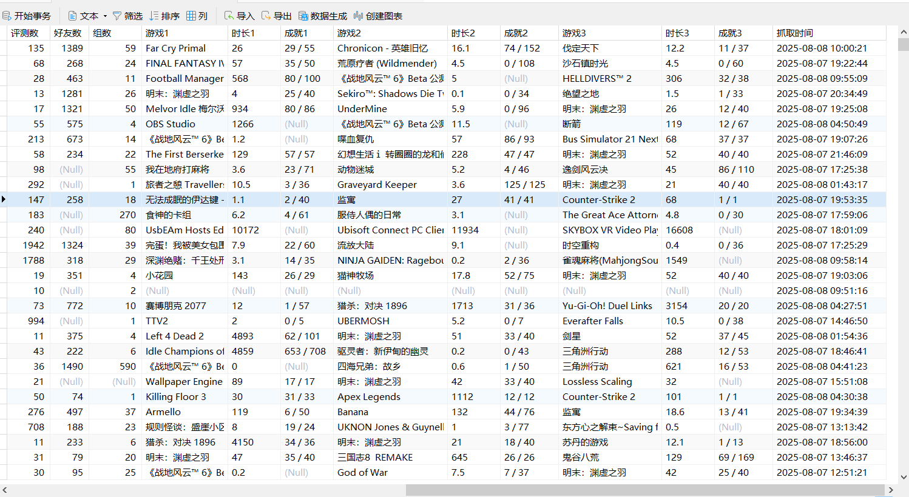
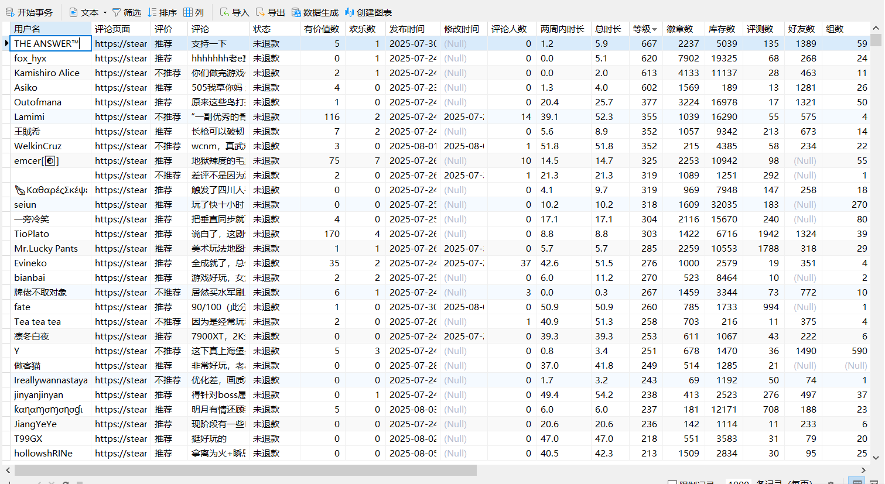

# Steam 游戏评测信息爬虫

<font size=5>**博客地址**</font>
[Steam 游戏评测信息爬虫](https://blog.ldyer.top/2025/08/08/Steam%E6%B5%8B%E8%AF%84%E7%88%AC%E8%99%AB/)
<font size=5>**本人的其他爬虫地址:**</font>
[B站评论爬虫（bilibili-comment-crawler）](https://github.com/1dyer/bilibili-comment-crawler)
[微博评论爬虫（weibo-comment-crawler）](https://github.com/1dyer/weibo-comment-crawlerr)

这是一个用于爬取 Steam 游戏评测信息的高效两阶段 Python 爬虫项目。

- **第一阶段**: 使用 `DrissionPage` 自动化浏览器，模拟用户“无限滚动”加载操作，以获取指定游戏的所有评测页面的独立链接。
- **第二阶段**: 读取第一阶段生成的链接列表，使用 `requests` 和 `lxml` 高效地解析每个评测页面的详细信息，并将结构化数据存入 MySQL 数据库。


        steam-review-spider/
        ├── 获取steam各个评论链接.py # 第一阶段：获取每条评论的链接
        ├── 解析评价.py # 第二阶段：解析评论详情并写入数据库
        ├── 评论URL.txt # 存储抓取到的评论页面URL
        ├── README.md # 项目说明文档

**即先执行"获取steam各个评论链接"，然后再执行"解析评价"**


## 🦄效果展示



## ✨ 项目特点

- **两阶段分离**: 将动态内容加载（浏览器自动化）与静态内容解析（HTTP请求）分离，兼顾了爬取完整性和执行效率。
- **详细数据采集**: 不仅爬取评测本身，还深入到用户主页，抓取用户的等级、徽章、游戏时长、最近游玩等丰富信息。
- **健壮的数据存储**:
    - 数据持久化到 **MySQL** 数据库，方便后续分析。
    - 脚本会自动初始化数据库和表结构。
    - 使用 `INSERT ... ON DUPLICATE KEY UPDATE` 语句，支持增量更新，可重复运行而不产生重复数据。
- **良好的容错性**:
    - 包含对 Steam 反爬虫机制（“抱歉！”页面）的检测和延时重试。
    - 对解析失败的 URL 会进行记录，并在主流程结束后自动重试，确保数据完整性。
- **结构化代码**: 项目分为两个独立的脚本，职责分明，易于理解和维护。

## 🛠️ 技术栈

- **Python 3**
- **浏览器自动化**: `DrissionPage`
- **HTTP 请求**: `requests`
- **HTML 解析**: `lxml`
- **数据库**: `MySQL`
- **数据库连接**: `pymysql`

## 📦 环境准备与安装

1.  **安装 Python 3**
    确保你的系统中已经安装了 Python 3。

2.  **安装依赖库**
    打开终端或命令行，执行以下命令：
    ```bash
    pip install DrissionPage requests lxml pymysql
    ```

3.  **安装 MySQL 数据库**
    你需要在本地或服务器上有一个正在运行的 MySQL 实例。

4.  **浏览器**
    `DrissionPage` 会自动下载匹配的浏览器驱动。请确保你的电脑上安装了 Chrome 或 Edge 浏览器。

## ⚙️ 配置

在运行脚本前，你需要进行一些必要的配置。

1.  **配置目标游戏 (`获取steam各个评论链接.py`)**
    打开 `获取steam各个评论链接.py` 文件，修改 `steam_url` 变量为你想要爬取的游戏评测页面。你可以通过 Steam 商店页面的筛选器来定制 URL（例如，筛选特定语言、好评/差评等）。

    ```python
    # 游戏的评测页面(以黑神话：悟空为例)
    steam_url = 'https://steamcommunity.com/app/2358720/positivereviews/?p=1&browsefilter=mostrecent&filterLanguage=schinese'
    ```

2.  **配置数据库 (`解析评价.py`)**
    打开 `解析评价.py` 文件，修改 `DB_CFG` 字典中的数据库连接信息，替换为你自己的配置。

    ```python
    # ----------------- 数据库配置 -----------------
    DB_CFG = dict(
        host="localhost",
        port=3306,
        user="root",
        password="YOUR_PASSWORD",   # <--- 改成你自己的数据库密码
        db="steam",                 # <--- 你要使用的数据库名
        charset="utf8mb4"
    )
    ```

## 🚀 如何运行

请严格按照以下步骤顺序执行：

1.  **第一步：获取所有评测链接**

    运行 `获取steam各个评论链接.py` 脚本。
    ```bash
    python "获取steam各个评论链接.py"
    ```
    这个脚本会启动一个浏览器窗口，自动向下滚动页面直到所有评测加载完毕。完成后，会在项目根目录下生成一个 `评论URL.txt` 文件，里面包含了所有独立的评测页面链接。**如果评测很多的话，这会花费非常多的时间(万恶的G胖)**

2.  **第二步：解析评测并存入数据库**

    确认 `评论URL.txt` 文件已生成后，运行 `解析评价.py` 脚本。
    ```bash
    python "解析评价.py"
    ```
    此脚本会：
    - 自动连接到你的 MySQL 数据库，如果库和表不存在，则会自动创建。
    - 逐行读取 `评论URL.txt` 中的链接。
    - 访问每个链接，解析数据，并存入数据库。
    - 屏幕上会打印出每条 URL 的处理状态。如果遇到错误，会稍作等待并尝试重新处理。

3.  **第三步：验证数据**
    爬取完成后，你可以登录你的 MySQL 数据库，查询 `steam_sql` 表中的数据，以验证爬取结果。

## 📊 数据库表结构

脚本会自动创建名为 `steam_sql` 的表，其结构如下：

| 字段名 | 类型 | 描述 |
| :--- | :--- | :--- |
| 用户名 | VARCHAR(128) | 评测发布者用户名 |
| 评论页面 | VARCHAR(512) | 评测的唯一URL (主键) |
| 评价 | VARCHAR(32) | "推荐" 或 "不推荐" |
| 评论 | TEXT | 评测的详细内容 |
| 状态 | VARCHAR(32) | "未退款" 或 "已退款" 等 |
| 有价值数 | INT | 认为该评测有价值的人数 |
| 欢乐数 | INT | 认为该评测欢乐的人数 |
| 发布时间 | DATETIME | 评测首次发布的时间 |
| 修改时间 | DATETIME | 评测最后修改的时间 |
| 评论人数 | INT | 该评测下的回复数量 |
| 两周内时长 | VARCHAR(32) | 评测者在过去两周内的游戏时长 |
| 总时长 | VARCHAR(32) | 评测者的总游戏时长 |
| 等级 | INT | 评测者的Steam等级 |
| 徽章数 | INT | 评测者的徽章数量 |
| 库存数 | INT | 评测者的游戏库存数量 |
| 评测数 | INT | 评测者的总评测数量 |
| 好友数 | INT | 评测者的好友数量 |
| 组数 | INT | 评测者加入的组数量 |
| 游戏1/2/3 | VARCHAR(128) | 用户主页展示的最近游玩游戏 |
| 时长1/2/3 | VARCHAR(32) | 对应游戏的游玩时长 |
| 成就1/2/3 | VARCHAR(32) | 对应游戏的成就进度 |
| 抓取时间 | TIMESTAMP | 该条记录入库或更新的时间 |

## ⚠️ 注意事项

- **反爬虫**: Steam 网站有反爬虫机制。如果频繁请求，IP 可能会被临时封禁。`解析评价.py` 中已包含简单的反爬处理逻辑，但如果遇到大量失败，建议在代码中增加更长的延时 `time.sleep()` 或考虑使用代理IP。
- **网络问题**: 爬取过程依赖网络连接，请确保网络稳定。
- **页面结构变更**: 本爬虫依赖于 Steam 社区页面的 HTML 结构。如果未来 Steam 网站改版，XPath 路径可能需要相应更新。
- **隐私设置**: 如果用户的个人资料设置为私密，脚本将无法获取其等级、好友数等详细信息，对应字段会存为 `NULL`。
**最后，不要用来违法犯罪或者给别人带来不悦**
---
## 🐎 源码
### 获取steam各个评论链接
```py
import time
from DrissionPage import ChromiumPage


page = ChromiumPage()

count=1


# 游戏的评测页面(以明末为例)
steam_url = 'https://steamcommunity.com/app/2277560/positivereviews/?p=1&browsefilter=mostrecent&filterLanguage=schinese'

page.set.window.size(1600,1000)

page.get(steam_url)

while True:
    page.scroll.to_bottom()

    # 1. 先判断“到底”提示
    no_more = page.ele('#NoMoreContent')
    if no_more and no_more.states.is_displayed and '没有更多内容了。太伤感了。' in no_more.text:
        print('到底了，结束')
        break

    # 2. 没到底就执行 Steam 的加载函数
    page.run_js('CheckForMoreContent();',timeout=300)
    time.sleep(0.2)   # 等后端返回并渲染

elements = page.eles('xpath://div[@class="apphub_CardRow"]')
# 每个评论页面
with open('评论URL.txt', 'w', encoding='utf-8') as f:
    for ele in elements:
        url = ele.ele('xpath://@data-modal-content-url')
        f.write(url + '\n')
        print(count,url)
        count+=1

```
### 解析评价
```py
from datetime import datetime
import re
import time
from lxml import etree
import requests
import pymysql


# ----------------- 浏览器标识配置 -----------------
header = {
   "Accept": "text/html,application/xhtml+xml,application/xml;q=0.9,*/*;q=0.8",
   'Accept-Language': 'zh-CN,zh;q=0.9',
   "User-Agent":"Mozilla/5.0 (Windows NT 10.0; Win64; x64) AppleWebKit/537.36 (KHTML, like Gecko) Chrome/138.0.0.0 Safari/537.36 Edg/138.0.0.0",
}

# ----------------- 数据库配置 -----------------
DB_CFG = dict(
    host="localhost",
    port=3306,
    user="root",
    password="123456",   # 改成你自己的
    db="steam",          # 你自己的库名
    charset="utf8mb4"
)

# 初始化数据库：建库建表
def init_db():
    conn = pymysql.connect(**DB_CFG)
    try:
        with conn.cursor() as cur:
            # 如果库不存在会自动创建（可选）
            cur.execute("CREATE DATABASE IF NOT EXISTS steam CHARACTER SET utf8mb4;")
            conn.select_db(DB_CFG["db"])

            create_sql = """
            CREATE TABLE IF NOT EXISTS steam_sql (
                用户名 VARCHAR(128),
                评论页面 VARCHAR(512) PRIMARY KEY,
                评价 VARCHAR(32),
                评论 TEXT,
                状态 VARCHAR(32) NULL,
                有价值数 INT NULL,
                欢乐数 INT NULL,
                发布时间 DATETIME NULL,
                修改时间 DATETIME NULL,
                评论人数 INT NULL,
                两周内时长 VARCHAR(32) NULL,
                总时长 VARCHAR(32) NULL,
                等级 INT NULL,
                徽章数 INT NULL,
                库存数 INT NULL,
                评测数 INT NULL,
                好友数 INT NULL,
                组数 INT NULL,
                游戏1 VARCHAR(128) NULL,
                时长1 VARCHAR(32) NULL,
                成就1 VARCHAR(32) NULL,
                游戏2 VARCHAR(128) NULL,
                时长2 VARCHAR(32) NULL,
                成就2 VARCHAR(32) NULL,
                游戏3 VARCHAR(128) NULL,
                时长3 VARCHAR(32) NULL,
                成就3 VARCHAR(32) NULL,
                抓取时间 TIMESTAMP DEFAULT CURRENT_TIMESTAMP
            ) ENGINE=InnoDB DEFAULT CHARSET=utf8mb4;
            """
            cur.execute(create_sql)
        conn.commit()
    finally:
        conn.close()


# 写入或更新单条数据
def save_to_db(row):
    """
    row 是 get_info() 返回的整条 tuple
    """
    conn = pymysql.connect(**DB_CFG)
    try:
        with conn.cursor() as cur:
            sql = """
            INSERT INTO steam_sql (
                用户名,评论页面,评价,评论,状态,有价值数,欢乐数,
                发布时间,修改时间,评论人数,两周内时长,总时长,
                等级,徽章数,库存数,评测数,好友数,组数,
                游戏1,时长1,成就1,游戏2,时长2,成就2,游戏3,时长3,成就3
            ) VALUES (
                %s,%s,%s,%s,%s,%s,%s,%s,%s,%s,%s,%s,%s,%s,%s,%s,%s,%s,%s,%s,%s,%s,%s,%s,%s,%s,%s
            )
            ON DUPLICATE KEY UPDATE
                用户名=VALUES(用户名),
                评价=VALUES(评价),
                评论=VALUES(评论),
                状态=VALUES(状态),
                有价值数=VALUES(有价值数),
                欢乐数=VALUES(欢乐数),
                发布时间=VALUES(发布时间),
                修改时间=VALUES(修改时间),
                评论人数=VALUES(评论人数),
                两周内时长=VALUES(两周内时长),
                总时长=VALUES(总时长),
                等级=VALUES(等级),
                徽章数=VALUES(徽章数),
                库存数=VALUES(库存数),
                评测数=VALUES(评测数),
                好友数=VALUES(好友数),
                组数=VALUES(组数),
                游戏1=VALUES(游戏1),
                时长1=VALUES(时长1),
                成就1=VALUES(成就1),
                游戏2=VALUES(游戏2),
                时长2=VALUES(时长2),
                成就2=VALUES(成就2),
                游戏3=VALUES(游戏3),
                时长3=VALUES(时长3),
                成就3=VALUES(成就3),
                抓取时间=CURRENT_TIMESTAMP
            """
            cur.execute(sql, row)
        conn.commit()
    finally:
        conn.close()


# 定义一个函数来读取文件中的 URL
def read_urls_from_file(file_path):
    urls = []  # 创建一个空列表来存储 URL
    with open(file_path, 'r', encoding='utf-8') as file:  # 打开文件
        for line in file:  # 遍历文件的每一行
            line = line.strip()  # 去掉行首尾的空白字符（包括换行符）
            if line:  # 如果行不为空
                urls.append(line)  # 将 URL 添加到列表中
    return urls  # 返回包含所有 URL 的列表

# 提取并格式化时间
def format_steam_time(raw):
    # 去掉前缀
    cleaned = raw.replace("发布于：", "").replace("更新于：", "")
    # 正则提取
    full_match = re.search(
        r'(?:(\d{4}) 年 )?(\d{1,2}) 月 (\d{1,2}) 日 (上午|下午) (\d{1,2}):(\d{2})',
        cleaned
    )
    
    if not full_match:
        return None
    
    year_str, month, day, period, hour, minute = full_match.groups()

    # 年份
    year = int(year_str) if year_str else datetime.now().year

    # 转换为24小时制
    hour = int(hour)
    if period == '下午' and hour != 12:
        hour += 12
    if period == '上午' and hour == 12:
        hour = 0
    # 构造 datetime 对象（年份用当前年份）
    dt = datetime(year, int(month), int(day), hour, int(minute))
    return dt.strftime("%Y-%m-%d %H:%M")


# 获取用户信息
def user_info(user_url,header):
    response = etree.HTML(requests.get(url=user_url,headers=header).content.decode('utf-8'))

    # 判断是否触发反爬机制
    try:
        test = response.xpath('//*[@id="mainContents"]/div/h1/text()')[0]
        while test == '抱歉！':
            print("当前页面被反爬，暂停10秒")
            time.sleep(10)
            response = etree.HTML(requests.get(url=user_url,headers=header).content.decode('utf-8'))
            test = response.xpath('//*[@id="mainContents"]/div/h1/text()')[0]
    except:
        pass

    # 等级
    try:
        level = response.xpath('//*[@class="friendPlayerLevelNum"]/text()')[0]
        level = int(level)
    except:
        level = None
    
    # 徽章数
    try:
        badges = response.xpath('//span[contains(text(),"徽章")]/following-sibling::span/text()')[0]
        badges = int(badges.replace(',', '')) if badges else 0
    except:
        badges = None

    # 库存数
    try:
        games = response.xpath('//span[contains(text(),"游戏")]/following-sibling::span/text()')[0]
        games = int(games.replace(',', '')) if games else 0
    except:
        games = None

    # 评测数
    try:
        reviews = response.xpath('//span[contains(text(),"评测")]/following-sibling::span/text()')[0]
        recommended = int(reviews.replace(',', '')) if reviews else 0
    except:
        recommended = None

    # 好友数
    try:
        friends = response.xpath('//span[contains(text(),"好友")]/following-sibling::span/text()')[0]
        friends = int(friends.replace(',', '')) if friends else 0
    except:
        friends = None

    # 组数
    try:
        groups = response.xpath('//span[contains(text(),"组")]/following-sibling::span/text()')[0]
        groups = int(groups.replace(',', '')) if groups else 0
    except:
        groups = None

    # 最近游玩
    games_list = response.xpath('//div[@class="recent_game_content"]')

    # 初始化列表
    game = [None] * 3
    play_time = [None] * 3
    chievement = [None] * 3
    for i in range(3):
        # 前三游戏名称
        try:
            game[i] = games_list[i].xpath('.//div[@class="game_name"]/a/text()')[0].strip()
        except:
            game[i] = None
        # 游玩时长
        try:
            play_time[i] = games_list[i].xpath('.//div[@class="game_info_details"]/text()')[0].strip().split(' ')[1].replace(",",'')
        except:
            play_time[i] = None
        # 成就
        try:
            chievement[i] = games_list[i].xpath('.//span[@class="ellipsis"]/text()')[0].strip().replace(" of ", "/")
        except:
            chievement[i] = None

    # 返回等级、徽章数、库存数、评测数、好友数、组数、最近游玩前三游戏信息
    return level,badges,games,recommended,friends,groups,game[0],play_time[0],chievement[0],game[1],play_time[1],chievement[1],game[2],play_time[2],chievement[2]


# 获取评测信息
def get_info(url,header):
    response = etree.HTML(requests.get(url=url,headers=header).content.decode('utf-8'))

    # 用户名
    user_name = response.xpath('//*[@id="responsive_page_template_content"]/div/div[1]/div/div/span[1]/a/text()')[0].strip()

    # 用户主页
    user_url = response.xpath('//*[@id="responsive_page_template_content"]/div/div[1]/div/div/span[1]/a/@href')[0].strip()

    # 评价
    valuation = response.xpath('//*[@id="ReviewTitle"]/div[1]/div[1]/text()')[0].strip()

    # 评论
    recommend = ' '.join(' '.join(response.xpath('//*[@id="ReviewText"]//text()')).split()).replace('\u200b','')

    # 状态
    try:
        status = response.xpath('//*[@class="refunded tooltip"]//text()')[0].strip()[2:]
    except:
        status = "未退款"

    # 认为有价值人数
    try:
        help_text = response.xpath('//*[@id="leftContents"]/div[2]/text()[1]')[0]
        help = int(re.sub(r'[^\d]', '', help_text)) if help_text else 0
    except:
        help = 0

    # 认为欢乐人数
    try:
        happy_text = response.xpath('//*[@id="leftContents"]/div[2]/text()[2]')[0]
        happy = int(re.sub(r'[^\d]', '', happy_text)) if happy_text else 0
    except:
        happy = 0

    # 发布时间
    posted_time = format_steam_time(response.xpath('//*[@id="ReviewTitle"]/div[2]/text()[1]')[0].strip())

    # 修改时间
    try:
        updated_time = format_steam_time(response.xpath('//*[@id="ReviewTitle"]/div[2]/text()[2]')[0].strip())
    except:
        updated_time = None

    # 评论人数
    try:
        relpy_counts = response.xpath('//div[@class="commentthread_header_and_count"]//span[contains(@id,"totalcount")]/text()')[0]
        relpy_counts = int(re.sub(r'[^\d]', '', relpy_counts)) if relpy_counts else 0
    except:
        relpy_counts = 0

    # 游戏时间
    the_time = response.xpath('//*[@id="ReviewTitle"]/div[1]/div[2]/text()')[0].strip().split('/')

    # 两周内该游戏时长
    two_weeks_play_time = the_time[0].strip().split('周')[1].split('小时')[0].strip() if len(the_time) > 0 else None

    # 该游戏总共游玩时长
    all_time = the_time[1].strip().split(' ')[1] if len(the_time) > 1 else None


    return user_name,url,valuation,recommend,status,help,happy,posted_time,updated_time,relpy_counts,two_weeks_play_time,all_time,*user_info(user_url,header)

# 存入数据库
def load_to_sql(urls):
    # 构建容错列表
    defeat_url = []
    # 逐条抓取并入库
    for url in urls:
        try:
            row = get_info(url, header)
            save_to_db(row)
            print(f"[√] 已写入/更新：{url}")
        except Exception as e:
            print(f"[×] 处理失败：{url}，错误：{e}")
            print("等待10秒......")
            defeat_url.append(url)
            time.sleep(10)
    return defeat_url


# ----------------- 主程序 -----------------
if __name__ == '__main__':
    # 初始化数据库
    init_db()

    # 读取 URL 列表
    urls = read_urls_from_file('评论URL.txt.txt')

    # 构建容错列表
    defeat_url = load_to_sql(urls)
    while len(defeat_url) != 0:
        defeat_url = load_to_sql(defeat_url)

    print("爬取失败的URL:",defeat_url)
```
